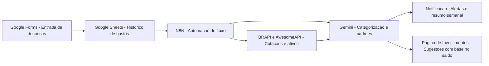

# Assistente Financeiro 💰

## Integrantes

- Vicente Dei Santi Montanheiro
- Bruno Cunha Beltramini
- Lucas Ribeiro Cavalcante Lima

## Descrição do projeto

O Assistente Financeiro é um sistema que ajuda o usuário a organizar seus gastos e entender melhor seus hábitos financeiros. A proposta é receber dados de despesas por formulário, consultar informações externas quando necessário, usar inteligência artificial para classificar os gastos e identificar padrões de consumo, além de enviar notificações ou alertas relevantes.

## Objetivo

Facilitar o controle financeiro pessoal, automatizando a categorização de despesas e gerando insights sobre o comportamento de consumo do usuário.

## Funcionalidades esperadas

- Cadastro de gastos
- Histórico financeiro
- Categorização automática com IA
- Identificação de padrões de consumo
- Geração de alertas e notificações
- Visualização resumida dos gastos
- Página de investimentos com sugestões baseadas no saldo

## Integrações previstas

- Entrada de dados: Google Forms para registrar despesas
- API externa: BRAPI e AwesomeAPI para cotações e ativos financeiros
- IA: Gemini para análise e categorização automática dos gastos
- Notificação: envio de alertas sobre excesso de gastos, categorias mais usadas ou resumos periódicos

## Arquitetura

## Observações

Este projeto ainda está em fase inicial e poderá ser ajustado conforme orientação do professor ao longo das próximas aulas.
