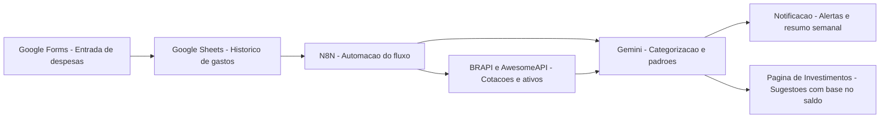
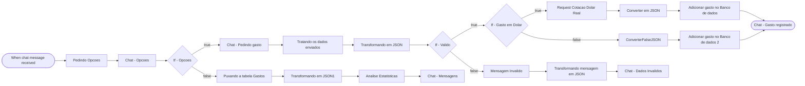

# Assistente Financeiro 💰

## Integrantes
- Vicente Dei Santi Montanheiro
- Bruno Cunha Beltramini
- Lucas Ribeiro Cavalcante Lima

## Descrição do projeto
O Assistente Financeiro é um sistema que ajuda o usuário a organizar seus gastos e entender melhor seus hábitos financeiros. A proposta é receber dados de despesas por formulário, consultar informações externas quando necessário, usar inteligência artificial para classificar os gastos e identificar padrões de consumo, além de enviar notificações ou alertas relevantes.

## Objetivo
Facilitar o controle financeiro pessoal, automatizando a categorização de despesas e gerando insights sobre o comportamento de consumo do usuário.

## Como funciona

**Entrada:** o usuário informa seus gastos por meio de um formulário no Google Forms, preenchendo dados como valor, data e descrição da despesa. Também pode interagir diretamente com o assistente via chat, informando gastos em texto livre — inclusive em moeda estrangeira, como dólar.

**Processamento:** o sistema recebe os dados, valida as informações e os armazena no Google Sheets. Em paralelo, o N8N orquestra o fluxo automatizado: consulta a cotação do dólar na AwesomeAPI quando necessário, converte os valores e aciona o Gemini para categorizar os gastos e identificar padrões de consumo. Caso os dados enviados sejam inválidos, o sistema notifica o usuário e aguarda uma nova entrada correta.

**Saída:** o usuário recebe confirmações de registro via chat, alertas sobre excessos de gastos, resumos periódicos do seu comportamento financeiro e sugestões de investimentos com base no saldo disponível, consultando ativos e cotações via BRAPI.

## Funcionalidades esperadas
- Cadastro de gastos
- Histórico financeiro
- Categorização automática com IA
- Identificação de padrões de consumo
- Geração de alertas e notificações
- Visualização resumida dos gastos
- Página de investimentos com sugestões baseadas no saldo

## Integrações previstas
- Entrada de dados: Google Forms para registrar despesas
- API externa: BRAPI e AwesomeAPI para cotações e ativos financeiros
- IA: Gemini para análise e categorização automática dos gastos
- Notificação: envio de alertas sobre excesso de gastos, categorias mais usadas ou resumos periódicos

## Arquitetura

```mermaid
flowchart LR
    A[Google Forms - Entrada de despesas] --> B[Google Sheets - Historico de gastos]
    B --> C[N8N - Automacao do fluxo]
    C --> D[Gemini - Categorizacao e padroes]
    C --> E[BRAPI e AwesomeAPI - Cotacoes e ativos]
    E --> D
    D --> F[Notificacao - Alertas e resumo semanal]
    D --> G[Pagina de Investimentos - Sugestoes com base no saldo]
```

## Fluxo do Chatbot

```mermaid
flowchart LR
    A([When chat message received]) --> B[Pedindo Opcoes]
    B --> C[Chat - Opcoes]
    C --> D{If - Opcoes}

    D -- true --> E[Chat - Pedindo gasto]
    D -- false --> P[Puxando a tabela Gastos]

    E --> F[Tratando os dados enviados]
    F --> G[Transformando em JSON]
    G --> H{If - Valido}

    H -- true --> I{If - Gasto em Dolar}
    H -- false --> J[Mensagem Invalido]

    I -- true --> K[Request Cotacao Dolar Real]
    I -- false --> N[ConverterFalseJSON]

    K --> L[Converter em JSON]
    L --> M[Adicionar gasto no Banco de dados]

    N --> O[Adicionar gasto no Banco de dados 2]

    M --> R([Chat - Gasto registrado])
    O --> R

    J --> J1[Transformando mensagem em JSON]
    J1 --> J2[Chat - Dados Invalidos]

    P --> Q[Transformando em JSON1]
    Q --> S[Analise Estatisticas]
    S --> T[Chat - Mensagens]
```

## Observações
Este projeto ainda está em fase inicial e poderá ser ajustado conforme orientação do professor ao longo das próximas aulas.
